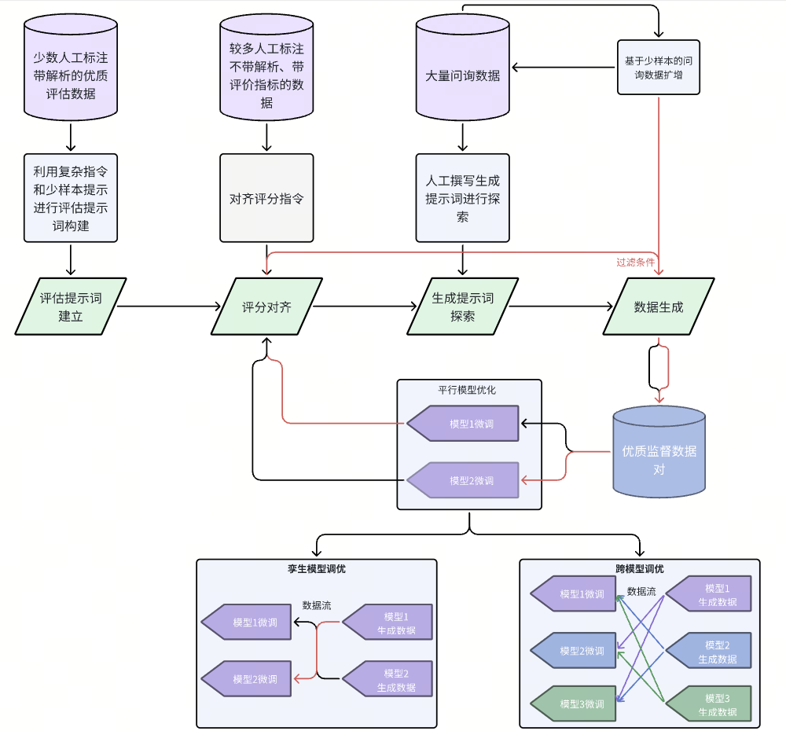

# Research on High-quality Data Generation Method and Self-optimization Framework for Large Language Model (SoF-LLM)
## 基于大语言模型的高质量数据生成方法与模型自优化框架研究(SoF-LLM)
### Codes and Datasets
+ Datasets are in composition.zip and reading.zip, please check the readme.md in each zip file.

Flow Chart: 

Cite:
Chinese version:

`
刘益枫. 基于大语言模型的高质量数据生成方法与模型自优化框架研究[D] 清华大学，2024
`

English version:

`
Yifeng Liu (2024). Research on High-quality Data Generation Method and Self-optimization Framework for Large Language Model [Unpublished undergraduate thesis]. Tsinghua University.
`
